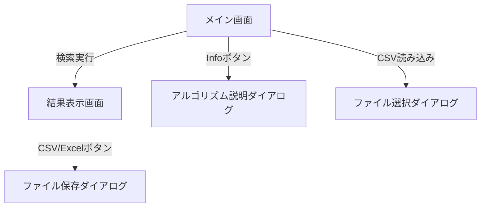

# 外部設計書

## 1. 画面構成
本アプリケーションは、主に「メイン画面」と「結果表示画面」の2つの画面で構成される。

### 1.1 メイン画面 (Main Window)
ユーザーが検索の準備（ファイルの選択、キーワードの設定、アルゴリズムの選択）を行う画面。

- **ファイルドロップ領域**:
  - ファイルをドラッグ＆ドロップするためのエリア。
  - 現在選択されているファイル数、合計サイズ、および推定検索時間を表示する。
- **アルゴリズム選択エリア**:
  - ラジオボタンにより検索手法を選択。
  - 「Info」ボタンにより、選択中のアルゴリズムの詳細説明を表示。
- **検索オプションエリア**:
  - レーベンシュタイン距離の設定（Bitap アルゴリズム用）。
- **検索キーワード入力エリア**:
  - 動的に追加可能なテキスト入力欄。
  - 「検索ワードを CSV から読み込み」ボタン。
  - 「検索ワード追加」ボタン。
- **実行ボタン**:
  - 「検索実行」ボタンにより検索を開始。

### 1.2 結果表示画面 (Result Window)
検索完了後に自動的に開き、詳細な結果を表示する画面。

- **データ一覧 (Treeview)**:
  - ファイル名、検索パターン、ヒット件数、出現位置、編集距離（Bitap のみ）を表示。
- **エクスポートボタン**:
  - 「CSV」出力ボタン。
  - 「Excel」出力ボタン。

## 2. ユーザーインターフェース (UI) 仕様
- **ライブラリ**: `tkinter`, `ttkbootstrap`, `tkinterdnd2`
- **デザイン**: モダンなフラットデザインを採用（`ttkbootstrap` によるテーマ適用）。
- **入力制御**:
  - 未入力やファイル未選択の状態での実行時はエラーメッセージを表示。
  - 検索キーワード入力時、動的に推定検索時間を更新。

## 3. 入出力仕様
### 3.1 入力
- **対象ファイル**: `.txt`, `.docx`, その他テキストとして読み込み可能なファイル。
- **キーワードファイル**: 1列目にキーワードが記載された CSV ファイル。

### 3.2 出力
- **CSV エクスポート**:
  - ヘッダー: `ファイル名, パターン, 件数, 位置`
  - 文字コード: UTF-8
- **Excel エクスポート**:
  - ヘッダーは CSV と同様。
  - `.xlsx` 形式。

## 4. 画面遷移図

