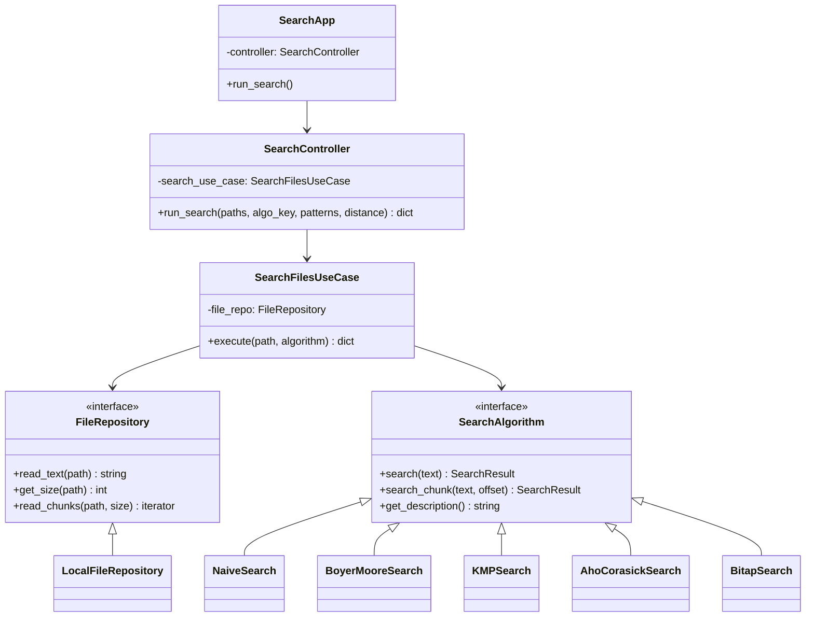

# 内部設計書

## 1. システムアーキテクチャ
本アプリケーションは、**クリーンアーキテクチャ (Clean Architecture)** の思想に基づき、以下の4つのレイヤーで構成されている。これにより、ビジネスロジック、外部インターフェース、UIの分離を実現している。

### 1.1 レイヤー構造
- **Domain Layer (`programs/domain/`)**:
  - 最も中心となるレイヤー。
  - エンティティ（`SearchResult`）、インターフェース（`SearchAlgorithm`, `FileRepository`）、および検索アルゴリズムの具体的なロジックを含む。
- **Use Case Layer (`programs/use_cases/`)**:
  - アプリケーション固有のビジネスルール。
  - ファイルの検索実行（`SearchFilesUseCase`）、ベンチマーク実行、時間推定などを担当。
- **Interface Adapters Layer (`programs/adapters/`)**:
  - UI と ユースケースを繋ぐ。
  - `SearchController` が UI からの入力を受け取り、適切なユースケースを呼び出す。
- **Infrastructure Layer (`programs/infrastructure/`)**:
  - 最も外側のレイヤー。
  - `tkinter` による UI 実装、ファイルシステムへのアクセス（`LocalFileRepository`）、ファイル出力（`FileExporter`）の実装を含む。

## 2. クラス図 (Class Diagram)


## 3. シーケンス図 (Sequence Diagram) - 検索実行
```mermaid
sequence_loop
    User->>SearchApp: 検索実行クリック
    SearchApp->>SearchController: run_search(paths, patterns)
    SearchController->>SearchFilesUseCase: execute(path, algorithm)
    SearchFilesUseCase->>LocalFileRepository: get_size(path)
    alt ファイルサイズ < 50MB
        SearchFilesUseCase->>LocalFileRepository: read_text(path)
        LocalFileRepository-->>SearchFilesUseCase: text
        SearchFilesUseCase->>SearchAlgorithm: search(text)
        SearchAlgorithm-->>SearchFilesUseCase: SearchResult
    else ファイルサイズ >= 50MB
        loop Chunks
            SearchFilesUseCase->>LocalFileRepository: read_chunks(path)
            SearchFilesUseCase->>SearchAlgorithm: search_chunk(chunk)
        end
    end
    SearchFilesUseCase-->>SearchController: ResultData
    SearchController-->>SearchApp: FinalResults
    SearchApp->>ResultWindow: 表示
```

## 4. 主要な設計方針
- **依存性の逆転 (Dependency Inversion)**: `SearchFilesUseCase` は具象クラス（`LocalFileRepository`）ではなく、インターフェース（`FileRepository`）に依存している。
- **単一責任の原則 (Single Responsibility)**: 各アルゴリズムは自身の探索ロジックのみに集中し、ファイル入出力や UI 制御には関与しない。
- **ストリーミング処理**: 大容量ファイルに対しても、メモリ負荷を抑えつつ検索が可能な設計となっている。
